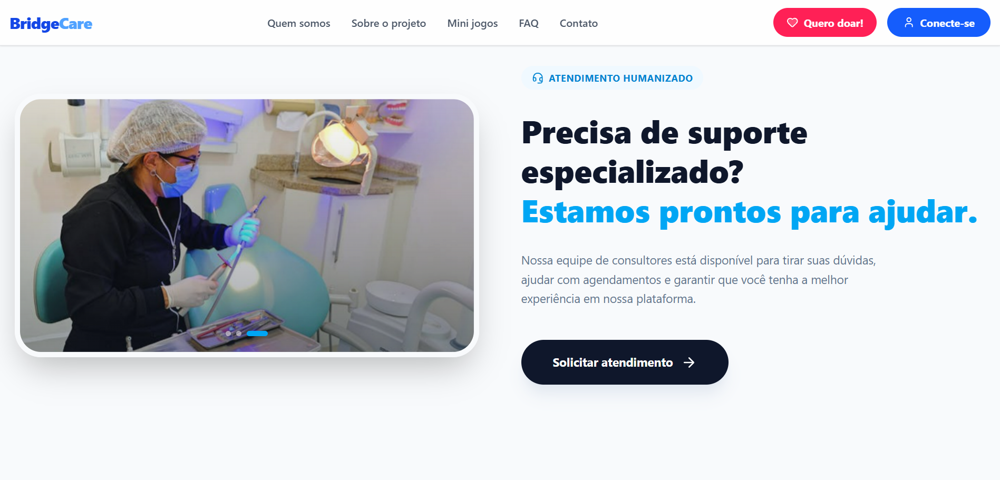
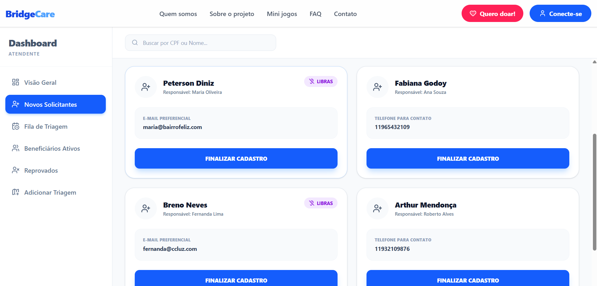

# 🦷 BridgeCare - Challenge ONG Turma do Bem

Este repositório apresenta a evolução da solução tecnológica para o challenge da ONG **Turma do Bem**, desenvolvida como parte do currículo acadêmico da **FIAP (ADS - 2026)**. 

Nesta etapa, o projeto deixou de ser um conjunto de páginas estáticas para se tornar uma **Single Page Application (SPA)** robusta, focada em escalabilidade, validação de dados e uma interface de alto impacto visual.

---

## 📸 Imagens e Interface do Projeto
*(Abaixo estão as representações visuais da nossa aplicação)*

---

## 👥 Autores e Equipe
* **Alan Christopher G. Miranda**
* **Lucas de S. Dudena**
* **Pedro Begali Campos**

---

## 🚀 Avanços Técnicos: Sprint 3
Demos um salto tecnológico considerável, adotando as ferramentas mais modernas do mercado de front-end:

* **Arquitetura React + Vite:** Migração completa para um ambiente de desenvolvimento veloz e otimizado.
* **Identidade Visual "Impacto e Modernidade":** Implementação de design system personalizado com **Tailwind CSS**, incluindo o uso de *Shape Dividers* (SVG) para transições orgânicas entre seções.
* **Gestão de Perfis (Dashboards):** Criação de áreas exclusivas e funcionais para **Dentistas**, **Atendentes** e **Beneficiários**, simulando um ecossistema real de gestão de saúde.
* **Validação Profissional de Formulários:** Implementação do **React Hook Form** na página de contato, garantindo integridade dos dados e melhor experiência do usuário (UX).
* **Responsividade Avançada:** Menu estilo "Hambúrguer" dinâmico para dispositivos móveis e layouts adaptativos em todas as seções.
* **Interatividade Educativa:** Jogo da Memória e Hub de Jogos totalmente refatorados em React para educação em saúde bucal.

---

## 🛠️ Tecnologias Utilizadas
A stack foi escolhida para garantir performance e facilidade de manutenção:

| Tecnologia | Finalidade |
| :--- | :--- |
| **React 18** | Biblioteca base para construção da interface declarativa. |
| **TypeScript** | Tipagem estática para evitar erros em tempo de execução. |
| **Vite** | Build tool de última geração para um ambiente dev ultra rápido. |
| **Tailwind CSS** | Framework de estilização utility-first para design responsivo. |
| **Lucide React** | Biblioteca de ícones vetoriais padronizados e profissionais. |
| **React Hook Form** | Gerenciamento e validação performática de formulários. |
| **React Router Dom** | Navegação SPA eficiente sem recarregamento de página. |

---

## 📂 Estrutura do Projeto
Otimizada para o processo de *Build* profissional:

* `/src/assets`: Imagens e recursos de mídia processados e otimizados pelo Vite.
* `/src/components`: Elementos reutilizáveis (Header, Footer, Cards).
* `/src/pages`: Componentes de página (Home, Sobre, Dashboards).
* `/src/App.tsx`: Gerenciador de rotas e estrutura principal.

---

## 🕹️ Funcionalidades em Destaque
* **Hub de Jogos:** Experiência gamificada para engajamento do público jovem.
* **Central de Atendimento:** Painel para triagem de novos beneficiários e suporte.
* **Prontuário Digital:** Visualização de histórico e agendamentos para dentistas e pacientes.

---

## 💻 Como Usar

Para testar a aplicação em ambiente de produção, acesse a URL da Vercel abaixo. **Esta aplicação já está consumindo remotamente a API criada na disciplina de Java**, permitindo que todos os testes de persistência, consultas e integrações sejam realizados em tempo real na base de dados.

* 🌐 **Deploy na Vercel:** [https://vercel.com/pedrobegalis-projects/bridge-care](https://vercel.com/pedrobegalis-projects/bridge-care)
* 📂 **Repositório GitHub:** [https://github.com/PedroBegali/BridgeCare_Sprint_4](https://github.com/PedroBegali/BridgeCare_Sprint_4)
* 🎥 **Apresentação YouTube:** [https://youtu.be/AFDLPd0bz2c](https://youtu.be/AFDLPd0bz2c)

---

## 🤝 Créditos

Este projeto foi desenvolvido com a mentoria dos professores da FIAP e é destinado à ONG Turma do Bem. 

---
*Projeto desenvolvido para fins acadêmicos - FIAP 2026.*